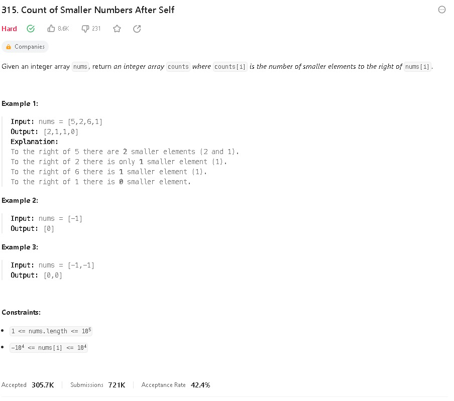
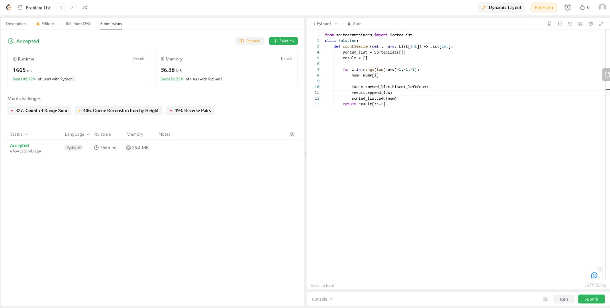
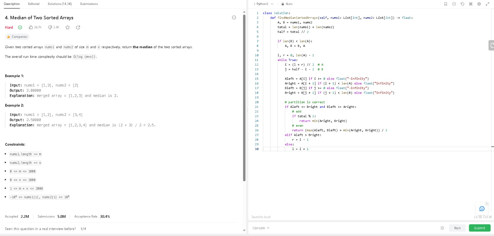
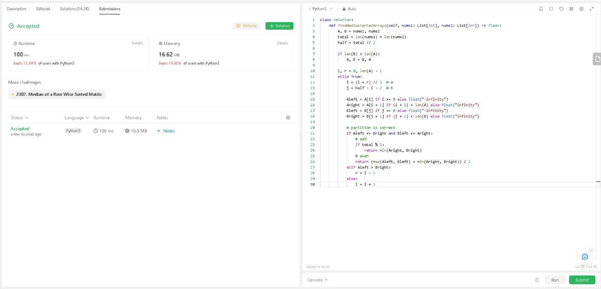

# DividirConquistar_LeetProblems-Public

# LeetCodeExercicios

**Conteúdo da Disciplina**: Dividir e Conquistar 

## Alunos
|Matrícula | Aluno |
| -- | -- |
| 21/1039312| Danilo Carvalho Antunes |

## Sobre 
Este repositório contém a resolução de dois exercícios do [LeetCode](https://leetcode.com/)

## Exercício 315. Count of Smaller Number  After Self

Dificuldade: **Hard  **
Link: [Exercício 315. Count of Smaller Number  After Self](https://leetcode.com/problems/count-of-smaller-numbers-after-self/description/)

_ScreenShot1_

_ScreenShot2_

# Median of Two Sorted Arrrays

Dificuldade: **Hard  **
Link: [Exercício 4. Median of Two Sorted Arrrays](https://leetcode.com/problems/median-of-two-sorted-arrays/description/)

_ScreenShot3_
_ScreenShot4_

## [Clique aqui para ver a apresentação](https://youtu.be/qrUQ6rzVsNA)

## Instalação 
**Linguagem**: Python 

Caso queira testar localmente é necessário ter o python instalado
## Uso 
Para verificar o funcionamento basta abrir o link do exercicio e copiar o código referente a questão, e logo após realizar o envio. Caso queira verificar localmente, é necessário adicionar a chamada da função principal com seus devidos paramêtros. para rodar basta utilizar o comando:

`python3 NomeDoArquivo.py`